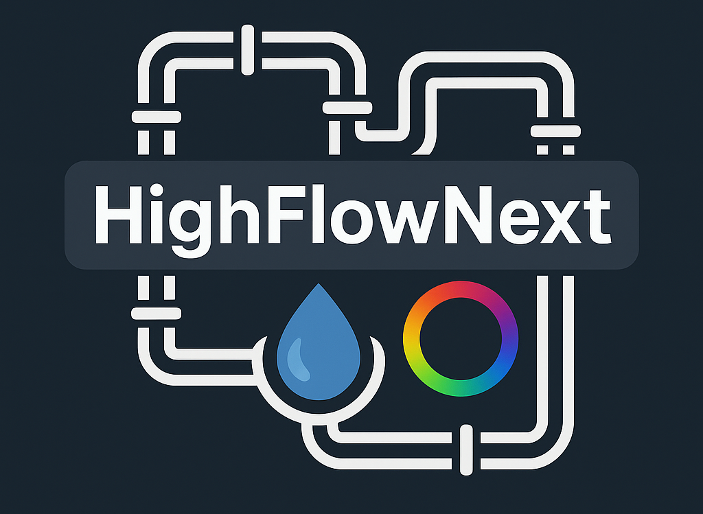

`HighFlowNext` is a Rust library for communicating with the [Aquacomputer high flow NEXT](https://shop.aquacomputer.de/Monitoring-and-Controlling/Sensors/Flow-sensor-high-flow-NEXT-G1-4::3953.html) device. It provides strongly typed access to the device’s binary protocol, allowing you to interact with sensor values, settings, and configuration in a safe and structured way. The primary goal of this project is to enable clean integration of the high flow NEXT into [OpenRGB](https://openrgb.org), so that device data and lighting controls can be accessed and managed alongside other RGB hardware.

> [!IMPORTANT]
>
> This is **not an official implementation** from Aquacomputer.

> [!WARNING]
>
> No guarantees are given regarding correctness, completeness, or stability of the protocol description. Use it at your own risk.

# Features

- Reading the settings frame (**done**)
- Writing the settings frame (**planned**)
- Reading / Writing the strings frame (**planned**)
- Reading sensor values
- Writing ambient color data (**planned**)
- Writing sound data (**planned**)

# Use Cases

`HighFlowNext` is intended as a building block for an `OpenRGB` integration. By decoding the device’s settings and sensor values, it becomes straightforward to surface flow rate, temperatures, and conductivity within the `OpenRGB` UI or its plugins.

Planned write-paths for ambient color and sound data aim to let `OpenRGB` drive `RGBpx` lighting effects on the high flow NEXT directly, coordinating lighting with the rest of a system’s devices.

Beyond `OpenRGB`, the crate can also support monitoring, logging, and automation workflows where you want to read configuration, calibrations, and live telemetry and then act on it in your own services or dashboards.

# Protocol Specification

If you are only interested in the details of the communication protocol itself,
please have a look at the included [specification file](https://github.com/Bergmann89/HighFlowNext/blob/master/doc/SPECIFICATION). It describes the binary
layout of settings, frames, effects, colors, and source control mappings.

# License

This crate is licensed under the MIT License.
